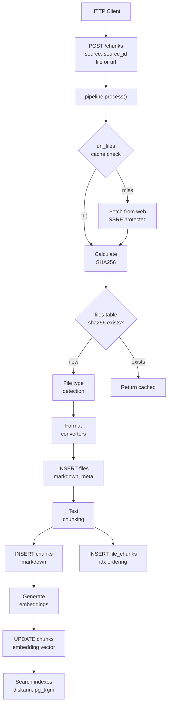

# Chunkydonkey

This fork was initially meant for reviewing the project. I have talked to creator of ChunkyDonkey. 
The project is by no means in a final working beta state, and at present he has no intention of finalizing the 
project. He regards the project as a learning and playground to develop his thoughts on how a data management and 
in/digestion platform for information retrival could be constructed while accounting for:

- minimizing data redundency
- ensuring access rights management  
- ensuring all data formats, relevant in a municipal setting, are handled satisfyingly
- ensuring crisp first response times for live uploads of documents in a user interaction while still providing a 
  suitable level of document analysis, but delayed.
  - Idea that if an agent needs more info from a doc than what the markdown extration and description can provide, then
    the original file, as an image, can be provided to the (multimodal) LLM  
- ensuring that this is not yet another persistent data storage "~~~single~~~ source of thruth" with the need to curate data (instead data dies, 
  when removed from parent storage or no longer used in case of docs from live interaction)
- built to ensure that docs originates from a single source of thruth

For the present the repo only reflects the data/information handling 

## Testing chunkydonkey

### Spin it up

```shell
docker compose up
```

### See it fail

```shell
curl -X POST http://localhost:5000/chunks   -F "source=test"   -F "source_id=example-doc-1"   -F "file=@README.md"   -F "meta={\"title\":\"Example Document\"}"
docker compose logs api
```

where it becomes clear that eg. the database connection is not yet implemented.

## Overview

an endpoint `/chunks` is planned og partly implemented.
- `POST` for adding content/documents
- `GET` for retrieving content



_flowchart is generate by deepwiki and taken from [there](https://deepwiki.com/jakobmwang/chunkydonkey/1-overview#ingestion-to-search-pipeline)_

### Additional relevant overview from deepwiki

_taken from [deepwiki](https://deepwiki.com/jakobmwang/chunkydonkey/1-overview#storage-architecture)_

> ## Storage Architecture
> ### Dual Storage Model
> ChunkyDonkey uses two complementary storage systems:
> ```mermaid
> graph TB
>     subgraph "PostgreSQL_Database"
>         FILES_TBL["files table\nsha256, markdown, meta\ntimestamps"]
>         CHUNKS_TBL["chunks table\nsha256, markdown, embedding"]
>         SOURCES_TBL["sources table\nsource, source_id, file_sha256"]
>         URLFILES_TBL["url_files table\nurl, file_sha256, fetched_at"]
>         FILEFILES_TBL["file_files table\nparent_sha256, child_sha256"]
>         FILECHUNKS_TBL["file_chunks table\nfile_sha256, chunk_sha256, idx"]
>         
>         INDEX_DISKANN["idx_chunks_embedding\nDiskANN ANN index"]
>         INDEX_TRGM["idx_chunks_markdown_trgm\ntrigram GIN index"]
>     end
>     
>     subgraph "SeaweedFS_S3"
>         RAWFILES["Raw file bytes\nkeyed by SHA256"]
>     end
>     
>     FILES_TBL --> FILEFILES_TBL
>     FILES_TBL --> FILECHUNKS_TBL
>     FILES_TBL --> SOURCES_TBL
>     FILES_TBL --> URLFILES_TBL
>     
>     CHUNKS_TBL --> INDEX_DISKANN
>     CHUNKS_TBL --> INDEX_TRGM
>     CHUNKS_TBL --> FILECHUNKS_TBL
>     
>     FILES_TBL -..original bytes.-> RAWFILES
> ```
> 
> | Storage System | Data Type | Purpose | Key Structure |
> |----------------|-----------|---------|---------------|
> | **PostgreSQL** | Structured metadata | Queryable provenance, relationships, search | SHA256-keyed tables with FK relationships |
> | **SeaweedFS** | Raw file bytes | Blob storage, original file preservation | S3 buckets with SHA256 object keys |
> 
> **Why dual storage?**
> 
> - **Markdown as source of truth**: `files.markdown` is the canonical converted content; raw bytes in S3 enable re-conversion if algorithms change
> - **Search optimization**: Embeddings in PostgreSQL enable efficient vector search via pgvector/vectorscale
> - **Cost efficiency**: Large blobs (videos, high-res images) in S3; metadata/chunks in database
> - **Rebuild capability**: System can regenerate `chunks` table from `files.markdown` without re-fetching source files
> 
> For PostgreSQL schema details, see [Database Schema](#6). For S3 integration, see [S3-Compatible Blob Storage](#8.2).
> 
> **Sources:** [schema.sql:1-121](), [pyproject.toml:4]()
> 
> ## Key Technologies
> 
> | Technology | Purpose | Configuration |
> |------------|---------|---------------|
> | **FastAPI** | HTTP API framework | `main.py`, uvicorn server |
> | **PostgreSQL 17** | Relational storage | TimescaleDB distribution with extensions |
> | **pgvector** | Vector storage extension | Enabled in `schema.sql:4` |
> | **vectorscale (DiskANN)** | ANN index for embeddings | `CREATE INDEX ... USING diskann` |
> | **pg_trgm** | Trigram text search | GIN index for BM25-style search |
> | **SeaweedFS** | S3-compatible object storage | Blob storage backend |
> | **asyncpg** | Async PostgreSQL driver | Connection pooling in `db` module |
> | **pymupdf** | PDF text extraction | Used in `pdf_to_markdown` converter |
> | **trafilatura** | HTML content extraction | Used in `html_to_markdown` converter |
> | **polars** | Tabular data processing | Used in `tabular_to_markdown` converter |
> | **OpenAI API** | Vision Language Model | Image OCR and description generation |
> | **Gotenberg** | Office to PDF conversion | External service for DOCX/PPTX/XLSX |
> | **Browserless** | Headless browser | Dynamic web content rendering |
> 
> For complete dependency list, see [Dependencies and Build System](#12.2). For external service configuration, see [External Services](#11).
> 
> **Sources:** [pyproject.toml:6-21](), [schema.sql:4-5](), [schema.sql:102-103]()
> 
> ## System Characteristics
> 
> **Design Principles:**
> 
> - **Idempotency**: Content-addressable design makes re-processing safe
> - **Deduplication**: Automatic via SHA256 hashing at file and chunk levels
> - **Multi-tenancy**: Sources table enables isolated namespaces with shared storage
> - **Crash Recovery**: State tracking via timestamps enables restart from last checkpoint
> - **Extensibility**: Plugin-style converter architecture for new formats
> - **Separation of Concerns**: Storage (PostgreSQL + S3) separated from processing (converters
> 
> **Scalability Considerations:**
> 
> - Work queues enable distributed processing of conversion and embedding
> - Async API implementation supports high concurrency
> - Content deduplication reduces storage and processing overhead
> - Vector indexes (DiskANN) scale to millions of chunks


TODO:
- Sha hashing ikke i pipeline (men i et module) er i pg-vector