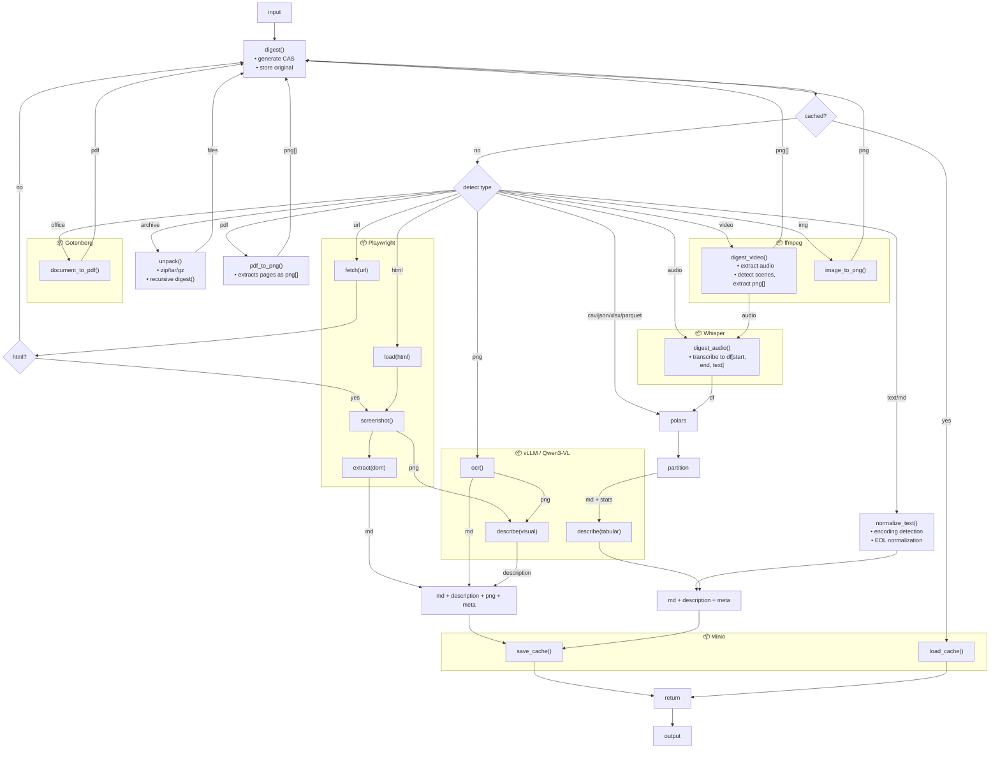

```mermaid
flowchart TD
    input["input"]
    digest["digest()
    • generate CAS
    • store original"]
    
    input --> digest
    digest --> cache_check{"cached?"}
    cache_check -->|yes| load_cache
    cache_check -->|no| detect_type{"detect type"}
    
    detect_type -->|archive| unpack["unpack()
    • zip/tar/gz
    • recursive digest()"]
    detect_type -->|text/md| normalize_text["normalize_text()
    • encoding detection
    • EOL normalization"]
    detect_type -->|audio| transcribe
    detect_type -->|video| ff_split
    detect_type -->|url| pw_fetch
    detect_type -->|html| pw_load
    detect_type -->|office| got_convert
    detect_type -->|pdf| pdftoppm["pdf_to_png()
    • extracts pages as png[]"]
    detect_type -->|img| ff_normalize
    detect_type -->|png| vlm_ocr
    detect_type -->|csv/json/xlsx/parquet| polars
    
    subgraph playwright ["📦 Playwright"]
        pw_fetch["fetch(url)"]
        pw_load["load(html)"]
        pw_screenshot["screenshot()"]
        pw_extract["extract(dom)"]
    end
    
    subgraph gotenberg ["📦 Gotenberg"]
        got_convert["document_to_pdf()"]
    end
    
    subgraph ffmpeg ["📦 ffmpeg"]
        ff_normalize["image_to_png()"]
        ff_split["digest_video()
        • extract audio
        • detect scenes, extract png[]"]
    end
    
    subgraph vllm ["📦 vLLM / Qwen3-VL"]
        vlm_ocr["ocr()"]
        vlm_describe_visual["describe(visual)"]
        vlm_describe_tabular["describe(tabular)"]
    end
    
    subgraph whisper ["📦 Whisper"]
        transcribe["digest_audio()
        • transcribe to df[start, end, text]"]
    end
    
    subgraph minio ["📦 Minio"]
        load_cache["load_cache()"]
        save_cache["save_cache()"]
    end
    
    transcribe -->|df| polars
    ff_split -->|audio| transcribe
    ff_split -->|"png[]"| digest
    unpack -->|files| digest
    normalize_text --> output_no_png
    
    pw_fetch --> is_html{"html?"}
    is_html -->|yes| pw_screenshot
    is_html -->|no| digest
    
    pw_load --> pw_screenshot
    pw_screenshot --> pw_extract
    pw_screenshot -->|png| vlm_describe_visual
    pw_extract -->|md| output_with_png
    
    got_convert -->|pdf| digest
    pdftoppm -->|"png[]"| digest
    ff_normalize -->|png| digest
    
    vlm_ocr -->|md| output_with_png
    vlm_ocr -->|png| vlm_describe_visual
    vlm_describe_visual -->|description| output_with_png
    
    polars --> partition["partition"]
    partition -->|md + stats| vlm_describe_tabular
    vlm_describe_tabular --> output_no_png
    
    output_with_png["md + description + png + meta"]
    output_no_png["md + description + meta"]
    
    output_with_png --> save_cache
    output_no_png --> save_cache
    save_cache --> return["return"]
    load_cache --> return
    return --> output_final["output"]
```
